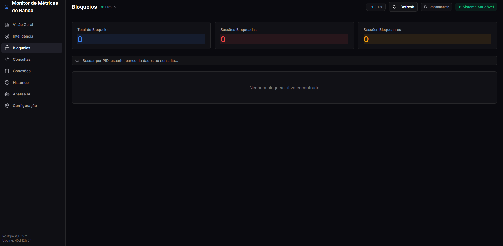
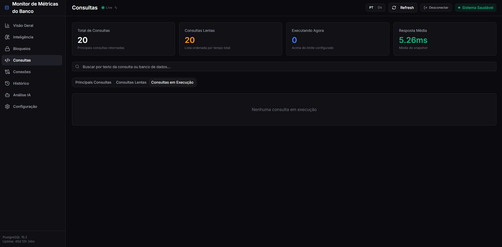
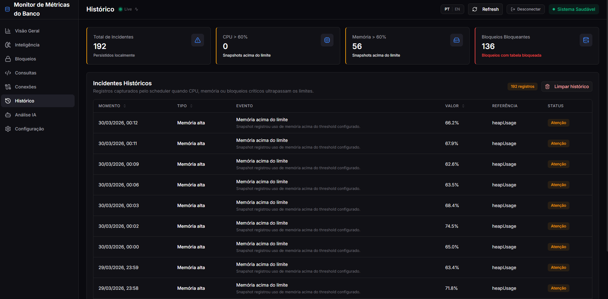

# DB Metrics Monitor

Plataforma de observabilidade operacional para PostgreSQL com backend em Spring Boot, frontend em React e uma camada de análise assistida por IA orientada a operação.

O projeto foi desenhado para responder duas perguntas principais:

1. O banco está saudável agora?
2. O que precisa ser feito quando há sinais de risco, saturação, locks, queries lentas ou comportamento fora da baseline?

## Visão Geral

- `backend`: API REST em Java 21 + Spring Boot 3
- `frontend`: interface React + Vite
- `data/`: persistência local de histórico operacional e configuração runtime
- `docs/screenshots/`: capturas de tela da aplicação

## Destaque Principal: Análise com IA

A tela de análise com IA é o diferencial funcional do projeto.

Ela não envia apenas um prompt solto para um modelo. A aplicação monta um contexto operacional consolidado do banco e do sistema antes de consultar a OpenAI. Isso inclui:

- resumo de conexões
- locks bloqueados e bloqueantes
- queries em execução
- top queries
- cache hit ratio
- uso de CPU e memória
- configurações importantes do PostgreSQL
- resumo de incidentes recentes
- prompt complementar opcional do operador

Com isso, a IA responde com um parecer mais útil para operação real, focando em:

- risco de saturação de conexões
- contenção por locks
- impacto de queries custosas
- sinais de degradação de cache
- leitura contextual do estado atual do ambiente

Também existe histórico de análises por banco monitorado, o que ajuda a comparar investigações anteriores e manter rastreabilidade operacional.

## O Que o Sistema Entrega

### Observabilidade operacional

- dashboard consolidado do ambiente
- monitoramento de conexões
- locks ativos, bloqueados e bloqueantes
- top queries, slow queries e running queries
- cache hit ratio
- métricas do processo Java e do host
- histórico de incidentes operacionais

### Intelligence determinística

- health score do banco
- breakdown de score por categoria
- alertas classificados por severidade
- detecção de anomalias por baseline histórica
- recomendações baseadas em correlação de sinais

### Operação assistida por IA

- análise do snapshot atual com OpenAI
- prompt complementar opcional
- histórico de chats/análises por banco
- teste de autenticação da OpenAI na área de configuração

### Configuração e autenticação

- teste de conexão com PostgreSQL antes de salvar
- autenticação/conexão do banco via backend
- configuração runtime persistida no backend
- configuração da OpenAI separada da configuração do banco

## Galeria

As imagens abaixo estão em `docs/screenshots/` e podem ser usadas como apoio visual do fluxo.

### Página inicial


### Intelligence


### Análise com IA


### Locks, queries, conexões e histórico






### Configuração


## Arquitetura

```text
.
|-- backend
|   |-- src/main/java/br/com/vivovaloriza/dbmetricsmonitor
|   |   |-- config
|   |   |-- controller
|   |   |-- dto
|   |   |-- exception
|   |   |-- intelligence
|   |   |-- repository
|   |   |-- scheduler
|   |   `-- service
|   `-- src/main/resources
|-- frontend
|   `-- src/app
|       |-- components
|       |-- context
|       |-- hooks
|       |-- lib
|       `-- pages
|-- data
|-- docs/screenshots
`-- README.md
```

## Stack

### Backend

- Java 21
- Spring Boot 3
- Spring Web
- Spring JDBC
- Spring Actuator
- Micrometer / Prometheus
- PostgreSQL JDBC Driver
- SQLite JDBC
- Bean Validation
- Lombok
- OpenAPI / Swagger

### Frontend

- React
- TypeScript
- Vite
- React Router
- Tailwind CSS
- Lucide React
- i18next

## Fluxo de Operação

1. Configurar credenciais do banco
2. Testar a conexão PostgreSQL
3. Salvar a configuração runtime
4. Configurar e testar a chave da OpenAI
5. Acompanhar o ambiente pelas telas operacionais
6. Consultar a camada de intelligence
7. Acionar a análise com IA quando precisar de interpretação operacional assistida

## Configuração Segura

Os exemplos abaixo usam placeholders. Não publique segredos reais no README, em `.env`, em commits ou em screenshots públicas.

### Backend

```powershell
$env:DB_URL_ADMIN="jdbc:postgresql://host:5432/seu_banco"
$env:DB_USER="seu_usuario"
$env:DB_PASSWORD="sua_senha"
$env:APP_API_KEY="defina-uma-chave-interna"
$env:APP_PROTECT_READ_ENDPOINTS="true"
$env:APP_OPENAI_API_KEY="sk-proj-xxxxxxxxxxxxxxxx"
$env:APP_OPENAI_MAX_OUTPUT_TOKENS="900"
```

### Frontend

```env
VITE_API_BASE_URL=/api/v1
VITE_API_KEY_HEADER=X-API-KEY
VITE_API_KEY=defina-uma-chave-interna
```

## Execução Local

### Requisitos

- Java 21
- Maven
- Node.js 20+ recomendado
- pnpm ou npm
- PostgreSQL acessível pelo backend

### Backend

```powershell
cd backend
mvn spring-boot:run
```

Se o seu ambiente tiver múltiplas JDKs, ajuste `JAVA_HOME` para Java 21 antes de subir.

### Frontend

```powershell
cd frontend
pnpm install
pnpm dev
```

Se preferir `npm`:

```powershell
cd frontend
npm install
npm run dev
```

### Docker Compose

```powershell
docker compose up --build
```

Arquivos adicionais disponíveis:

- `docker-compose.yml`
- `docker-compose.dev-valoriza.yml`
- `docker-compose.prod-valoriza.yml`

## Endpoints Principais

### Saúde e dashboard

- `GET /api/v1/health`
- `GET /api/v1/dashboard/summary`
- `GET /api/v1/system/metrics`

### Database monitoring

- `GET /api/v1/db/locks`
- `GET /api/v1/db/locks/blocking`
- `GET /api/v1/db/locks/blocked`
- `POST /api/v1/db/sessions/{pid}/terminate`
- `GET /api/v1/db/queries/top`
- `GET /api/v1/db/queries/slow`
- `GET /api/v1/db/queries/by-mean-time`
- `GET /api/v1/db/queries/running`
- `GET /api/v1/db/connections/summary`
- `GET /api/v1/db/connections/by-user`
- `GET /api/v1/db/connections/by-application`
- `GET /api/v1/db/cache/hit-ratio`
- `GET /api/v1/db/sessions/idle-in-transaction`
- `GET /api/v1/db/tables/top-size`
- `GET /api/v1/db/tables/top-access`
- `GET /api/v1/db/vacuum/health`

### Histórico

- `GET /api/v1/history/incidents`
- `GET /api/v1/history/incidents/page`
- `DELETE /api/v1/history/incidents`
- `GET /api/v1/history/summary`

### Intelligence

- `GET /api/v1/db/intelligence/overview`
- `GET /api/v1/db/intelligence/score`
- `GET /api/v1/db/intelligence/alerts`
- `GET /api/v1/db/intelligence/anomalies`
- `GET /api/v1/db/intelligence/recommendations`

### IA

- `POST /api/v1/ai/analysis`
- `GET /api/v1/ai/history`
- `DELETE /api/v1/ai/history`

### Configuração e autenticação

- `GET /api/v1/configuration`
- `PUT /api/v1/configuration`
- `POST /api/v1/configuration/database/test`
- `POST /api/v1/configuration/openai/test`
- `POST /api/v1/auth/connect`

## Telas da Aplicação

- `Overview`: visão consolidada do ambiente
- `Intelligence`: score, alertas, anomalias e recomendações
- `Locks`: investigação de bloqueios e sessões
- `Queries`: análise de consultas e ranking por custo
- `Connections`: uso atual e distribuição de conexões
- `History`: incidentes persistidos com paginação e limpeza
- `Análise IA`: parecer operacional assistido por OpenAI
- `Configurações`: conexão com banco, OpenAI e testes de autenticação

## Como a Análise com IA Funciona

### Entrada enviada para a IA

O backend monta um snapshot operacional e gera um prompt estruturado com:

- estado das conexões
- locks mais relevantes
- queries em execução
- top queries mais custosas
- parâmetros importantes do PostgreSQL
- cache hit ratio
- CPU e memória
- resumo de incidentes recentes
- observação manual do operador

### Saída esperada

A resposta da IA deve ser lida como apoio operacional, não como substituto de diagnóstico técnico definitivo. O uso ideal é:

- triagem rápida
- priorização de investigação
- interpretação de sinais concorrentes
- criação de hipótese inicial

### Boas práticas

- use prompts curtos e objetivos
- valide recomendações da IA com métricas da própria aplicação
- não trate a IA como fonte única de verdade
- mantenha a API key apenas no backend/configuração runtime

## Persistência Local

O projeto persiste dados operacionais localmente para suportar histórico e baseline. Isso inclui:

- histórico de incidentes
- histórico de análises com IA
- configuração runtime da aplicação

Arquivos e bancos locais ficam em `data/` e estruturas relacionadas no backend.

## Segurança

- não versione credenciais reais
- não publique `APP_OPENAI_API_KEY`
- não coloque usuários, senhas, hosts internos ou URLs privadas em documentação
- revise screenshots antes de publicar
- use placeholders em exemplos

## Documentação Complementar

- [backend/README.md](C:/Projetos/Vivo-Valoriza/db-metrics-monitor/backend/README.md)
- [frontend/README.md](C:/Projetos/Vivo-Valoriza/db-metrics-monitor/frontend/README.md)
- [backend/postgres-monitoring-queries.sql](C:/Projetos/Vivo-Valoriza/db-metrics-monitor/backend/postgres-monitoring-queries.sql)
- [backend/requests.http](C:/Projetos/Vivo-Valoriza/db-metrics-monitor/backend/requests.http)

## Observações Finais

Este repositório combina monitoramento tradicional, inteligência determinística e interpretação assistida por IA no mesmo fluxo operacional. O principal valor está em reduzir o tempo entre detectar um sintoma e entender o provável impacto operacional do banco.
